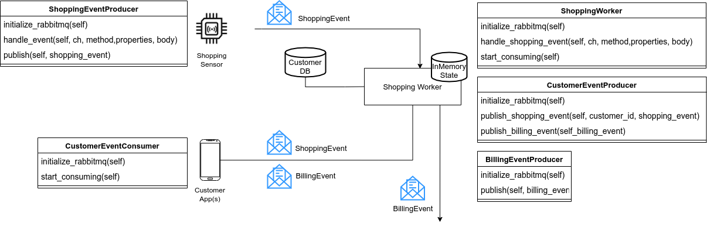
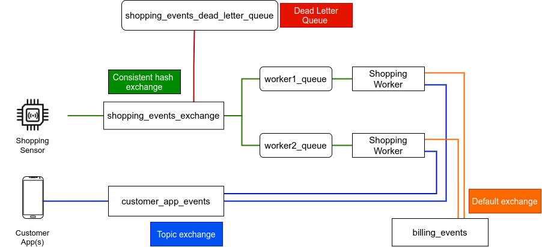

## Introduction
The code in this repo is part of an assignment for the Aalto-university course CS-E4190 - Cloud Software and Systems

There is a copy of the original template provided for the assignment in the exercise_template folder, and my solution in the exercise folder.

## Assignment
below is a copy of the actual assignment for this task

# Assignment: asynchronous messaging with RabbitMQ
This assignment introduces the concepts of asynchronous messaging often used in building distributed systems. The goal is to become familiar with RabbitMQ, a popular open source message broker, through a hands-on programming exercise.

## Getting started
Follow the [tutorial on MyCourses](https://mycourses.aalto.fi/mod/page/view.php?id=774573), which provides the necessary instructions to set up RabbitMQ and links to standard tutorials that describe the core concepts required for this assignment. This assignment is coded in Python (**version 3.6** or greater) and you must use the Pika client library (**version 1.2.0**) for RabbitMQ.

## Task
The assignment is to build a smart shopping application. The scenario comprises a **Shopping Sensor** that detects when customer picks and purchases a product out of shopping mall. The application logic resides in the **Shopping Worker** (backend) where pick up and purchase event messages generated by the shopping sensor are processed to calculate a shopping cost and to generate billing events. Customers that pick and purchase products receive alerts on their **Customer App** when they do so; they also receive billing information for shopping when exiting the shopping mall.

Your task is to create the necessary RabbitMQ messaging exchanges and queues for such a scenario as specified in the Requirements below.

## Code structure
The files in the exercise template are as follows:

- `requirements.txt` contains the required Python packages. You can add more libraries / packages to the requirements.txt file if needed.
- `db_end_event_definitions.py` defines the `customers_database`, `cost_per_unit` , `number_of_units` of shopping, and the format of `ShoppingEvent` and `BillingEvent`
- `shopping_sensor.py` defines a class `ShoppingEventProducer` which produces ShoppingEvent(s)
- `shopping_worker.py` defines three classes
  - `ShoppingWorker`: The main class that consumes ShoppingEvent(s) and processes them
  - `BillingEventProducer`: The class that produces BillingEvent(s)
  - `CustomerEventProducer`: The class that produces both ShoppingEvent(s) and  BillingEvent(s) to customers
- `customer_app.py` defines a class CustomerEventConsumer that consumes both ShoppingEvent(s) and BillingEvent(s) for a given customer
- `xprint.py` provides xprint() function that can be used to display your logs, even when executed on the grader.

You must add the logic for initializing RabbitMQ connections, creating message exchanges and queues to the functions therein. Specifically, the diagram shows the methods that you should implement.



You must use Pika’s Blocking Connection adapter , like so, se`lf.connection = pika.BlockingConnection(pika.ConnectionParameters('localhost'))`, assuming that RabbitMQ is running already on the same machine.

```
Attention

DO NOT change existing method names OR signatures, OR the variables declared in the constructors of any class (__init__() method).

More variables and methods can be added to the classes, but keep the existing ones.

The variables declared in __init__() must be appropriately initialized later in the class.

DO NOT alter the method names / signatures for the provided scaffolding as these interfaces are used to test your submission.

DO NOT alter the close() methods in the classes.

DO NOT alter the db_and_event_definitions.py as this file will be overwritten with a new database in the grading system.
```
## Instructions
**Overview**

A shopping sensor (ShoppingEventProducer) generates shopping events containing the entry_type (pick up or purchase), product number (identity of the product) and time stamp of the pick up and purchase event. These events are consumed by ShoppingWorkers.

ShoppingWorkers process these events by looking up customer information (i.e., a customer ID) from a product (product number), maintaining state of which products are currently in the customer basket, and finally calculating the amount the customer is to be charged when the purchase event is received. Shopping Workers also generate messages to the customer application. The customer application (CustomerEventConsumer) consumes messages that are relevant only for that customer.

To achieve this, you must implement the following:

1. The ShoppingEventProducer produces shopping events to an exchange named `shopping_events_exchange`. You must ensure that the pick up and purchase events for a particular product are consumed by the same worker.

	This is because a worker only saves memory in-state, and cannot communicate with other workers. You can accomplish this through a **consistent hash exchange** type by assigning **equal weight values** to both workers. This means that both workers will process roughly the same number of ShoppingEvents.

2. The ShoppingWorkers consume messages from a queue bound to the `shopping_events_exchange` (consistent hash exchange). On receiving a pick up or purchase shopping event, the worker looks up the customer associated with the product number. The workers produce shopping events for every `pick up` and `purchase` to a `customer_app_events` exchange.

	Additionally, when a product is purchased, the worker handling that particular customer produces a billing event to a queue called `billing_events` through a default (nameless) exchange. The billing event message must contain the following:

	- Customer ID
	- Product number
	- Pick up time
	- Purchase time
	- Shopping cost

	Note that there is a **20% discount** going on in the shopping center so the shopping cost must be calculated based on `cost_per_unit` * `number_of_units` - 20% from `db_and_event_definitions.py`.

3. The ShoppingWorker maintains a dictionary called `shopping_state` and a list of all received ShoppingEvents called `shopping_events`. The dictionary `shopping_state` is used to maintain state of the products that are currently in the customer basket.

	When a products is picked up by a customer, an entry should be added to the dictionary, where the key is the `product number` and the value is the `timestamp` of the event: `self.shopping_state[shopping_event.product_number] = shopping_event.timestamp`.

	When a product is being purchased, the state should be removed from the dictionary. This can be done with `self.shopping_state.pop(shopping_event.product_number)`.

	When an purchase event is received for a product currently in the shopping_state dictionary, the product is removed from the dictionary, i.e., the product is no longer in the state.

	The list `shopping_events` contains all the ShoppingEvent objects received by the ShoppingWorker. The messages should be appended to the lists appropriately. The first message received should be saved at index 0, the second to index 1 and so on. In Python this can be achieved by using the append() method (e.g. `self.shopping_events.append(shopping_event)`)

4. If a `pick up` or `purchase` ShoppingEvent is received for an unknown product number (i.e., the product number does not exist in the `customers_database`), it **MUST NOT** be added to the `shopping_state` dictionary. Instead, the ShoppingWorker must negatively acknowledge such a message. The exchange should be set up in such a way that a negatively acknowledged message should be republished by the RabbitMQ Broker to a dead letter queue called `shopping_events_dead_letter_queue`.

5. The CustomerEventConsumer consumes shopping events and billing events **only** relevant to it (based on the customer-ID) from the `customer_app_events` exchange.

	You can accomplish this through a **topic exchange**. The CustomerEventConsumer must also maintain two lists of `shopping_events` and `billing_events` containing the received ShoppingEvents and BillingEvents respectively. These two lists maintain all events received by the customer app, and the messages should be appended to the above lists appropriately. The first message received should be appended to index 0, the second to index 1 and so on. In Python this can be achieved by using the append() method (e.g. `self.shopping_events.append(shopping_event)`)

The diagram below shows an overview of the exchanges and messaging queues to be implemented.
 

## How to test your code
We have provided three Python scripts (in the scaffolding code under `scripts/`) that can help you test your code **locally**. With these scripts you can recreate the scenario that will be tested by our automated grading script. Once you have implemented the RabbitMQ exchanges and messaging, you can run the scripts as follows:

1. Start a worker with `python3 run_worker.py --id "<worker-id>" --queue "<worker-id>_queue" -w "1"`
2. Start a customer app with `python3 run_customer_app.py -c "<customer-id>"`
3. Generate ShoppingEvents through `python3 produce_shopping_event.py -e "pick up" -c "<customer-id>" -t 5` and `python3 produce_shopping_event.py -e "purchase" -c "<customer-id>" -t 10`

With these scripts you can check whether the messages are received as expected. You can start more **ShoppingWorkers** and **CustomerEventConsumers** in different shell windows to recreate the scenario that will be tested in the grader (described next).

## Grading
You must submit a zip archive containing the full implementation of shopping application. Your ZIP file must have the following structure:
```
./exercise.zip
└── exercise
    ├── __init__.py
    ├── requirements.txt (optional)
    ├── customer_app.py
    ├── db_and_event_definitions.py
    ├── shopping_sensor.py
    ├── worker.py
    ├── xprint.py
```

Our automated grading system relies on Python. The RabbitMQ server will be started on the same server in our test with the `rabbitmq_consistent_hash_exchange` plugin already enabled; thus, you only need to connect to `localhost` when initilizing the Pika Blocking Connection.

We will use your code to start two ShoppingWorkers and five different CustomerEventConsumers. The assignment will run the following tests, which give points as shown in the table below